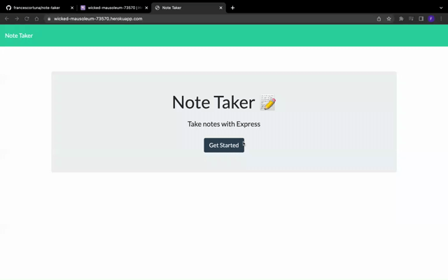

# Note Taker

## Description

- This application allows users to write and save notes.
- It shows existing and saved notes in the left hand column and allows users to delete them.
- This application uses Express.js to build its note API.

## Installation

N/A

## Usage

The application is deployed [here](https://wicked-mausoleum-73570.herokuapp.com/)  

Here is a video showcasing how it works: 
